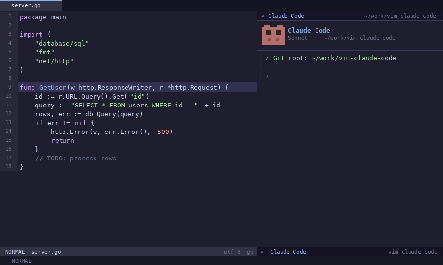
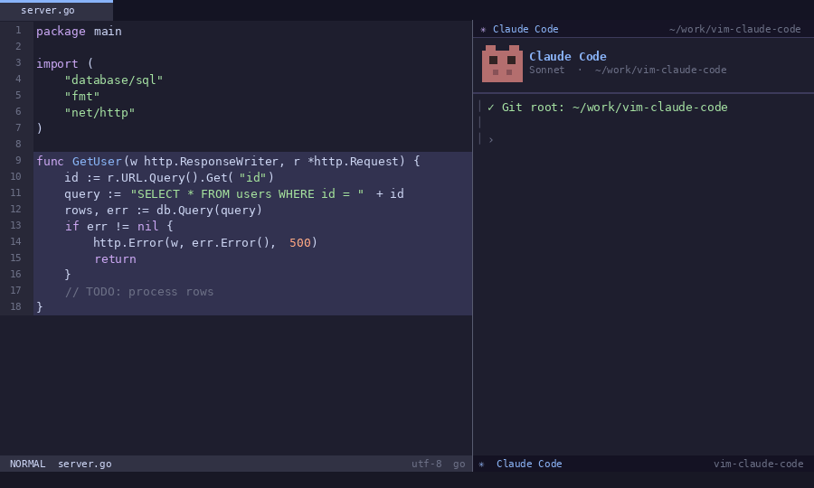
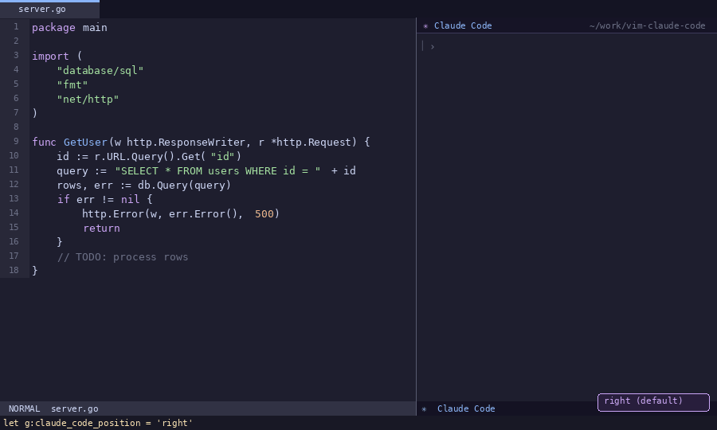
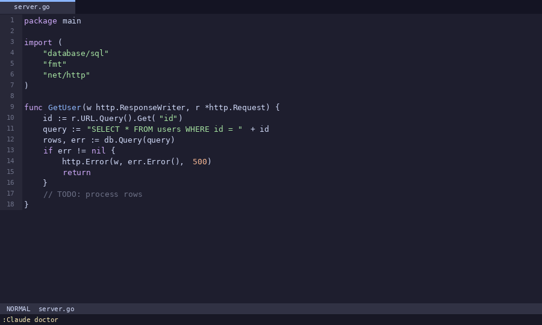
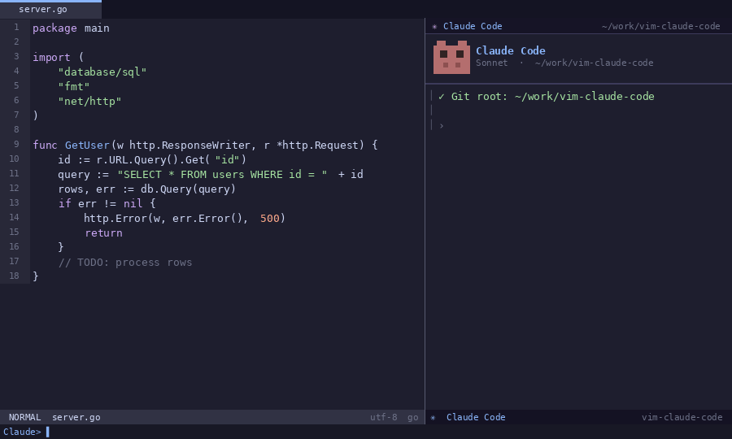
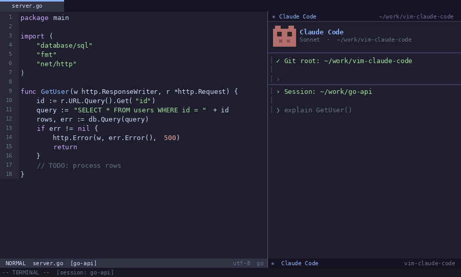
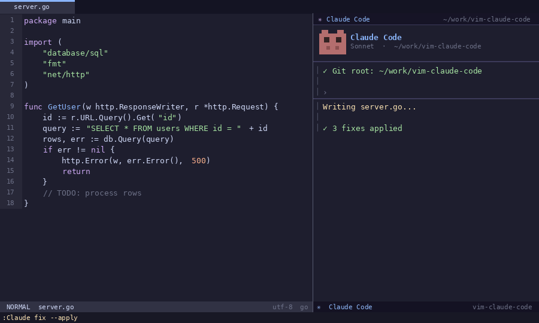
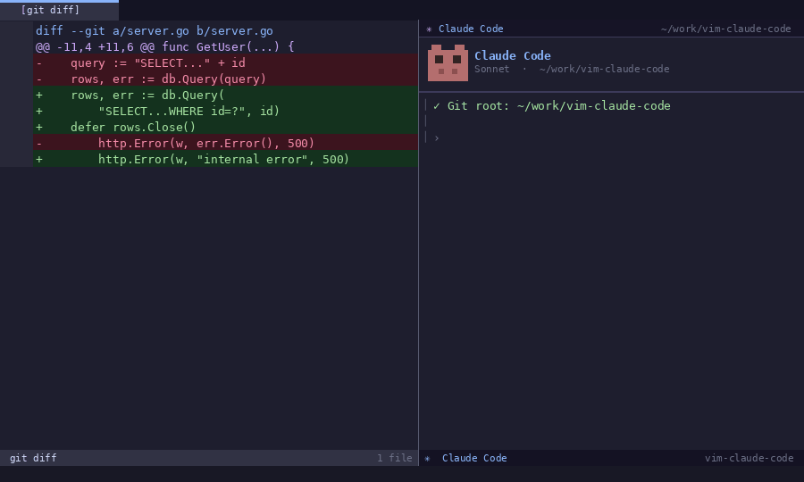

# vim-claude-code — Feature Demos

A visual walkthrough of every major feature in vim-claude-code. Each demo runs in under 90 seconds against a real Go codebase.

---

## 1. One-Key Toggle — Open, Hide, Restore

> **Key:** `<C-\>`

- Press `<C-\>` in Normal mode to **open** the Claude Code panel in a right split
- Press `<C-\>` again to **hide** it — your editor reclaims the full width
- Press `<C-\>` once more to **restore** — the session is never lost, conversation history intact
- Works identically from Terminal mode inside the Claude panel

---

## 2. Instant Bug Fixing — `:Claude fix --apply`

> **Command:** `:Claude fix --apply`

- Claude automatically detects the current function (or uses your visual selection)
- Identifies a **SQL injection** vulnerability (string concatenation in a query)
- Identifies a **resource leak** (rows never closed after a DB query)
- Patches both issues **in place** — no copy-paste required
- Shows a summary of changes in the Claude panel before writing to disk

---

## 3. Visual Selection → Test Generation

> **Workflow:** `Shift-V` to select, then `:Claude test --edge-cases`

- Enter Visual Line mode with `Shift-V` and select the function you want tested
- Run `:Claude test --edge-cases` — Claude receives exactly the selected lines as context
- Generates **9 edge-case tests** covering positive, zero, negative, overflow, and concurrency scenarios
- Test names follow the `Test<Func>_<Scenario>` convention automatically
- Works with any test framework; specify with `--framework <name>` (e.g., `--framework testify`)

---

## 4. Git Workflow — Commit Message + PR Description

> **Commands:** `:Claude commit --conventional` and `:Claude pr`

- `:Claude commit --conventional` reads your **staged diff** and produces a [Conventional Commit](https://www.conventionalcommits.org/) message with type, scope, and body
- `:Claude pr` generates a full **PR description** with Summary, Changes, and Testing sections
- Both commands are diff-aware — Claude only sees what is actually staged
- Use `--amend` flag to rewrite the most recent commit message instead

---

## 5. Command Discovery with `<Tab>`

> **Shortcut:** `:Claude <Tab>`

- All **22 sub-commands** live under the single `:Claude` namespace
- Type `:Claude` then press `<Tab>` to open the Vim completion popup
- Continue typing to **filter** — e.g., `:Claude re<Tab>` shows `refactor`, `rename`, `resume`, `review`
- Each command description appears in the Claude panel as you cycle through
- No need to memorise anything — the full command set is always one `<Tab>` away

---

## 6. Code Explanation — `:Claude explain`

> **Command:** `:Claude explain` · **Flags:** `--brief`, `--detailed`

- Without a visual selection, Claude detects and explains the **current function**
- With a visual selection active, explains exactly the **selected lines**
- Covers: what the function does, its inputs and outputs, error handling strategy, and any notable patterns
- Use `--brief` for a one-liner summary, `--detailed` for a deep dive including data-flow notes
- Highlighted lines in the editor show exactly what context was sent to Claude

---

## 7. Refactor — `:Claude refactor --extract`

> **Command:** `:Claude refactor --extract`

- Extracts inline validation or repeated logic into a **named helper function**
- The original handler becomes shorter and easier to read (single responsibility)
- Available refactor flags: `--extract` · `--simplify` · `--optimize` · `--rename`
- Claude respects existing naming conventions and package structure
- Changes are previewed in the Claude panel before being applied

---

## 8. Window Layouts — 5 Modes

> **Config:** `let g:claude_code_position = 'right'` (or `bottom`, `top`, `left`, `float`, `tab`)

- **`right`** — Vertical split on the right (default, matches the screenshot)
- **`bottom`** — Horizontal split at the bottom (classic terminal feel)
- **`top`** — Horizontal split at the top
- **`float`** — Floating popup centred over the editor (requires `+popupwin`)
- **`tab`** — Claude lives in its own dedicated tab page
- Switch layout at any time with `let g:claude_code_position = '<mode>'` and re-open

---

## 9. Health Check — `:Claude doctor`

> **Command:** `:Claude doctor`

- Runs **6 checks** and reports `[OK]` or `[FAIL]` for each:
  - Claude CLI found in `$PATH`
  - Git installed
  - Vim compiled with `+terminal`
  - Vim version ≥ 8.1
  - `+popupwin` available (for float mode)
  - Claude authenticated (API key or OAuth)
- Run this first whenever something isn't working — it tells you exactly what to fix

---

## 10. Free-Form Chat — `:Claude chat`

> **Command:** `:Claude chat`

- Opens an input prompt at the bottom of the Claude panel
- Your **current file is automatically included** as context — no manual copy-paste
- Ask anything: architecture questions, code review requests, "how do I add rate limiting?", etc.
- Claude's response streams into the panel in real time
- Combine with `:Claude context` to preview exactly what context will be sent before asking

---

## 11. Multi-Instance — Separate Sessions per Repo

> **Config:** `let g:claude_code_multi_instance = 1` (default: on)

- Each **git repository** gets its own independent Claude Code session
- Switch between repos (e.g., a Go backend and a React frontend) without losing conversation history
- Sessions are keyed by git root — detected automatically via `git rev-parse --show-toplevel`
- Disable with `let g:claude_code_multi_instance = 0` if you prefer a single global session

---

## 12. Automatic File Refresh

> **Config:** `let g:claude_code_refresh_enable = 1` (default: on)

- When Claude edits a file on disk, the corresponding Vim buffer **reloads automatically**
- No manual `:e!` required — changes appear instantly in your editor
- A notification message confirms which buffer was reloaded (disable with `let g:claude_code_refresh_notify = 0`)
- Polling interval configurable: `let g:claude_code_refresh_interval = 1000` (ms)

---

## 13. Code Review — `:Claude review --security`

> **Command:** `:Claude review` · **Flags:** `--strict`, `--security`

- Reviews your **current diff** (what you've changed since last commit)
- `--security` flag focuses Claude on: injection vulnerabilities, missing auth checks, error leakage, and unsafe input handling
- `--strict` flag catches style issues, missing tests, and unclear naming in addition to bugs
- Issues are highlighted in the editor alongside the Claude panel explanation
- Run before every commit for a quick automated code review

---

## 14. Architecture Analysis — `:Claude analyze`

> **Command:** `:Claude analyze`

- Analyses the current file across three dimensions:
  - **Complexity** — cyclomatic complexity, lines of code, nesting depth
  - **Performance** — N+1 query patterns, hot-path allocations, missing indexes
  - **Security** — missing auth, exposed error details, unsafe type assertions
- Results organised by section in the Claude panel
- Suggestions are actionable — not just "this is complex", but "extract X into Y"

---

## 15. Documentation Generation — `:Claude doc --markdown`

> **Command:** `:Claude doc` · **Flags:** `--inline`, `--markdown`

- `--markdown` generates a standalone Markdown doc block (endpoint, request body, response, error codes)
- `--inline` inserts GoDoc / JSDoc comments directly above the function in the source file
- Selection-aware — document a single function or an entire file
- Follows the conventions of your language (GoDoc for Go, JSDoc for JS/TS, docstrings for Python)
- Output can be copied to your project wiki, README, or API reference docs

---

## Keybinding Quick Reference

| Mode | Key | Action |
|---|---|---|
| Normal | `<C-\>` | Toggle Claude Code terminal |
| Normal | `<Leader>ce` | Explain |
| Normal | `<Leader>cf` | Fix |
| Normal | `<Leader>cr` | Refactor |
| Normal | `<Leader>ct` | Test |
| Normal | `<Leader>cd` | Doc |
| Normal | `<Leader>cG` | Commit |
| Normal | `<Leader>cR` | Review |
| Normal | `<Leader>cp` | PR description |
| Normal | `<Leader>ca` | Analyze |
| Normal | `<Leader>cc` | Chat |
| Visual | `<Leader>c` + key | Same commands, but on selection |

See [README.md](README.md) for the full configuration reference.
