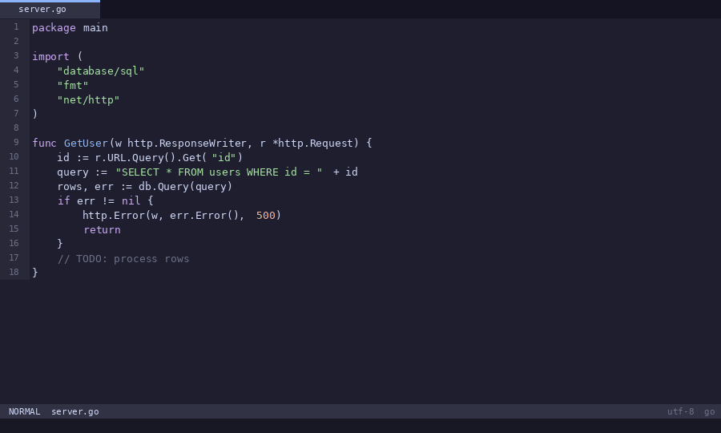
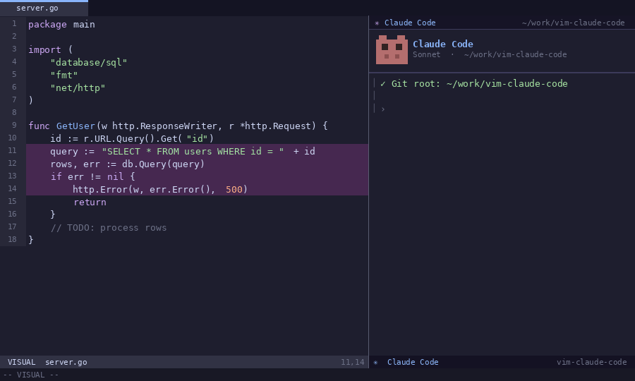
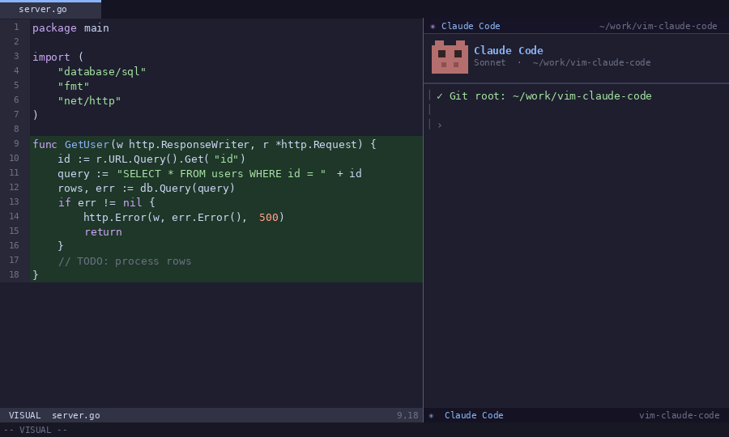
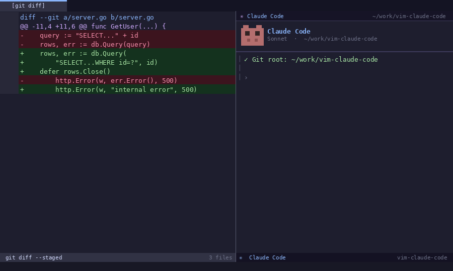
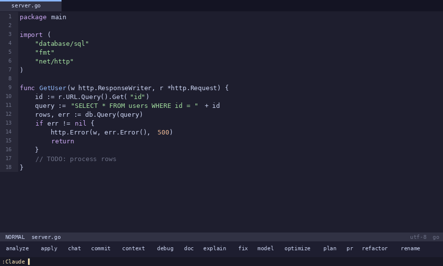

# vim-claude-code

[](https://github.com/rishi-opensource/vim-claude-code/actions/workflows/ci.yml)
[](CHANGELOG.md)

A Vim plugin that integrates the [Claude Code](https://docs.anthropic.com/en/docs/claude-code) CLI directly into your editor. Run Claude Code in a managed terminal, send code context with a single keystroke, and get automatic file reloading when Claude edits your files — all without leaving Vim.

## Features

- **One-key toggle** — Open and close Claude Code with `<C-\>`
- **22 sub-commands** — Explain, fix, refactor, test, document, commit, review, and more
- **Selection-aware** — Commands use visual selection when active, otherwise detect the current function
- **Multiple window layouts** — Bottom split, top split, vertical split, floating popup, or dedicated tab
- **Automatic file refresh** — Buffers reload when Claude modifies files on disk
- **Git-aware** — Starts Claude at the repository root; separate sessions per repo
- **Health check** — `:Claude doctor` verifies your environment before you start
- **Configurable** — 20+ `g:` variables with buffer-local overrides

## Demos

### One-key toggle — open, hide, restore
> `<C-\>` opens Claude in a split. Same key hides it. Session is never lost.



---

### Instant bug fixing — `:Claude fix --apply`
> Claude spots the SQL injection and resource leak, patches the file in place.



---

### Visual selection → test generation
> Select a function with `Shift-V`, run `:Claude test --edge-cases`. Nine tests written automatically.



---

### Git workflow — commit message + PR description
> `:Claude commit --conventional` reads your staged diff and writes a Conventional Commit. `:Claude pr` produces a full PR description with Summary, Changes, and Testing sections.



---

### Command discovery with `<Tab>`
> All 22 sub-commands live under `:Claude`. Type `:Claude <Tab>` to browse, filter by typing, and run — without memorising anything.




## Requirements

- Vim 8+ compiled with `+terminal`
- [Claude Code CLI](https://docs.anthropic.com/en/docs/claude-code) installed and in `$PATH`
- Optional: `+popupwin` for floating window mode

## Installation

> **Stable release — v1.0.0**
> Pin to the latest stable release using the examples below, or omit the tag
> to always track the latest commit on `main`.

### [vim-plug](https://github.com/junegunn/vim-plug)
```vim
" Always track latest
Plug 'rishi-opensource/vim-claude-code'

" Pin to stable release
Plug 'rishi-opensource/vim-claude-code', { 'tag': 'v1.0.0' }
```

### [Vundle](https://github.com/VundleVim/Vundle.vim)
```vim
Plugin 'rishi-opensource/vim-claude-code'
```
> Vundle does not support tag pinning. To pin manually after install:
> ```sh
> cd ~/.vim/bundle/vim-claude-code && git checkout v1.0.0
> ```

### [pathogen](https://github.com/tpope/vim-pathogen)
```sh
cd ~/.vim/bundle
git clone --branch v1.0.0 https://github.com/rishi-opensource/vim-claude-code.git
```

### Native packages (Vim 8+)
```sh
mkdir -p ~/.vim/pack/plugins/start
cd ~/.vim/pack/plugins/start
git clone --branch v1.0.0 https://github.com/rishi-opensource/vim-claude-code.git
```

### Manual
Copy `plugin/`, `autoload/`, and `doc/` into `~/.vim/`, then run inside Vim:
```vim
:helptags ALL
```
> Run `:helptags ALL` whenever you install or update the plugin to ensure
> `:help claude-code` works correctly.

## Releases

Stable releases are published as annotated git tags on GitHub.

| Release | Date | Notes |
|---|---|---|
| [v1.0.0](https://github.com/rishi-opensource/vim-claude-code/releases/tag/v1.0.0) | 2026-02-24 | First stable release |

See [CHANGELOG.md](CHANGELOG.md) for full details.

To upgrade to a specific release with pathogen or native packages:
```sh
cd ~/.vim/bundle/vim-claude-code   # or your pack path
git fetch --tags
git checkout v1.0.0
```

## Quick Start

Press `<C-\>` to open Claude Code. Press it again to hide; again to restore. The session persists.

All sub-commands are tab-completable:
```
:Claude <Tab>
```

Run a health check to verify your setup:
```vim
:Claude doctor
```

## Commands

### Terminal

| Command | Description |
|---|---|
| `:Claude` | Toggle the Claude Code terminal |
| `:Claude continue` | Toggle with `--continue` (resume last conversation) |
| `:Claude resume` | Toggle with `--resume` (interactive conversation picker) |
| `:Claude verbose` | Toggle with `--verbose` (detailed logging) |

### Code Intelligence

| Command | Flags | Description |
|---|---|---|
| `:Claude explain` | `--brief`, `--detailed` | Explain selected code or current function |
| `:Claude fix` | `--apply`, `--safe` | Fix bugs and correctness issues |
| `:Claude refactor` | `--extract`, `--simplify`, `--optimize`, `--rename` | Refactor code |
| `:Claude test` | `--framework {name}`, `--edge-cases` | Generate unit tests |
| `:Claude doc` | `--inline`, `--markdown` | Generate documentation |

### Git

| Command | Flags | Description |
|---|---|---|
| `:Claude commit` | `--conventional`, `--amend` | Generate commit message from staged diff |
| `:Claude review` | `--strict`, `--security` | Code review on current diff |
| `:Claude pr` | | Generate PR description |

### Architecture & Planning

| Command | Description |
|---|---|
| `:Claude plan` | Generate implementation plan for current file |
| `:Claude analyze` | Analyze for complexity, performance, and security |

### Workflow

| Command | Description |
|---|---|
| `:Claude rename` | Suggest better variable/function names |
| `:Claude optimize` | Optimize code for performance |
| `:Claude debug` | Analyze error on current line |
| `:Claude apply` | Apply Claude's last suggestion to the file (prompts for confirmation) |

### Meta

| Command | Description |
|---|---|
| `:Claude chat` | Send a free-form message with current file context |
| `:Claude context` | Preview what context will be sent to Claude |
| `:Claude model [name]` | Switch model (`sonnet`, `opus`, `haiku`) |

### Utility

| Command | Description |
|---|---|
| `:Claude version` | Show plugin version, Vim version, Claude CLI version, and terminal support |
| `:Claude doctor` | Health check: verifies Claude CLI, Git, terminal support, and Vim version |

## Keymaps

### Default keymaps

| Mode | Key | Action |
|---|---|---|
| Normal | `<C-\>` | Toggle Claude Code terminal |
| Normal | `<Leader>cC` | Toggle with `--continue` |
| Normal | `<Leader>cV` | Toggle with `--verbose` |
| Terminal | `<C-\>` | Hide Claude Code terminal |
| Terminal | `<C-h/j/k/l>` | Navigate to adjacent window |

### Extended keymaps (`<Leader>c*`)

| Key | Command | Key | Command |
|---|---|---|---|
| `<Leader>ce` | explain | `<Leader>cG` | commit |
| `<Leader>cf` | fix | `<Leader>cR` | review |
| `<Leader>cr` | refactor | `<Leader>cp` | pr |
| `<Leader>ct` | test | `<Leader>cP` | plan |
| `<Leader>cd` | doc | `<Leader>ca` | analyze |
| `<Leader>cn` | rename | `<Leader>cD` | debug |
| `<Leader>co` | optimize | `<Leader>cA` | apply |
| `<Leader>cc` | chat | `<Leader>cx` | context |
| `<Leader>cm` | model | | |

Visual mode: `<Leader>c` + `e/f/r/t/d/n/o` operate on the selection.

To disable all default keymaps:
```vim
let g:claude_code_map_keys = 0
let g:claude_code_map_extended_keys = 0
```

## Window Modes

Set `g:claude_code_position` to one of:

| Value | Layout |
|---|---|
| `'bottom'` | Horizontal split at the bottom (default) |
| `'top'` | Horizontal split at the top |
| `'left'` | Vertical split on the left |
| `'right'` | Vertical split on the right |
| `'float'` | Floating popup (requires `+popupwin`) |
| `'tab'` | Dedicated tab page |

```vim
" Right split at 40%
let g:claude_code_position   = 'right'
let g:claude_code_split_ratio = 0.4

" Floating popup
let g:claude_code_position    = 'float'
let g:claude_code_float_width  = 0.85
let g:claude_code_float_height = 0.85
let g:claude_code_float_border = 'double'
```

## Configuration

| Variable | Default | Description |
|---|---|---|
| `g:claude_code_command` | `'claude'` | CLI executable |
| `g:claude_code_position` | `'bottom'` | Window layout |
| `g:claude_code_split_ratio` | `0.3` | Terminal size (0.0–1.0) |
| `g:claude_code_enter_insert` | `1` | Auto-enter Terminal mode on focus |
| `g:claude_code_hide_numbers` | `1` | Hide line numbers in terminal |
| `g:claude_code_hide_signcolumn` | `1` | Hide sign column in terminal |
| `g:claude_code_use_git_root` | `1` | Start Claude at git root |
| `g:claude_code_multi_instance` | `1` | Separate session per git repo |
| `g:claude_code_map_keys` | `1` | Register default toggle keymaps |
| `g:claude_code_map_extended_keys` | `1` | Register `<Leader>c*` keymaps |
| `g:claude_code_map_toggle` | `'<C-\>'` | Toggle key |
| `g:claude_code_map_continue` | `'<Leader>cC'` | Continue key |
| `g:claude_code_map_verbose` | `'<Leader>cV'` | Verbose key |
| `g:claude_code_refresh_enable` | `1` | Auto-reload changed buffers |
| `g:claude_code_refresh_interval` | `1000` | Polling interval (ms) |
| `g:claude_code_refresh_notify` | `1` | Notify on buffer reload |
| `g:claude_code_float_width` | `0.8` | Popup width fraction |
| `g:claude_code_float_height` | `0.8` | Popup height fraction |
| `g:claude_code_float_border` | `'rounded'` | Border style |
| `g:claude_code_model` | `''` | Claude model override |
| `g:claude_code_debug` | `0` | Enable debug logging to message area |
| `g:claude_code_terminal_start_delay` | `300` | Delay (ms) before attaching to Claude terminal |

Buffer-local `b:claude_code_*` overrides take precedence over `g:` variables.

## Plugin Structure

```
vim-claude-code/
├── plugin/
│   └── claude_code.vim           # Entry point: command + keymaps
├── autoload/
│   └── claude_code/
│       ├── config.vim            # Configuration defaults + get/set
│       ├── terminal.vim          # Terminal lifecycle (create/toggle/close)
│       ├── terminal_bridge.vim   # Terminal lookup and prompt dispatch
│       ├── window.vim            # Window layout utilities
│       ├── git.vim               # Git root detection with caching
│       ├── keymaps.vim           # Terminal-local keymaps
│       ├── refresh.vim           # File change detection and reload
│       ├── util.vim              # Shared helpers (selection, context, error, debug)
│       ├── commands.vim          # explain, fix, refactor, test, doc
│       ├── git_commands.vim      # commit, review, pr
│       ├── arch_commands.vim     # plan, analyze
│       ├── workflow_commands.vim # rename, optimize, debug, apply
│       └── meta_commands.vim     # chat, context, model, version, doctor
├── test/
│   ├── vimrc                     # Minimal vimrc for test runner
│   └── test_dispatch.vader       # Vader test suite
├── .github/
│   └── workflows/
│       └── ci.yml                # GitHub Actions CI (Vim 8 + Vim 9)
└── doc/
    └── claude_code.txt           # :help documentation
```

## Help

```vim
:help claude-code
```

## Troubleshooting

**Run the health check first:**
```vim
:Claude doctor
```
This reports `[OK]` / `[FAIL]` for each dependency and tells you exactly what to fix.

---

**E117: Unknown function** — Run `:helptags ALL` then restart Vim. Ensure the
plugin directory is on your `runtimepath`.

**Terminal does not open** — Verify `vim --version | grep +terminal`. The plugin
requires Vim compiled with `+terminal`. Run `:Claude doctor` to confirm.

**Claude not found** — Ensure `claude` is in `$PATH`: `which claude`. Run
`:Claude doctor` to confirm.

**File changes not detected** — Check `g:claude_code_refresh_enable` is `1` and
that `autoread` is not globally disabled in your vimrc.

**Debug logging** — Enable verbose output to diagnose issues:
```vim
let g:claude_code_debug = 1
```
All internal events (dispatch, terminal launch, git calls, refresh) will be
printed to the message area. Disable again with `let g:claude_code_debug = 0`.

## 🚧 Roadmap

### v1.x

- UX improvements and workflow refinements
- Add more intelligent `:Claude` subcommands
- Improve diagnostics and configuration options

### v2.0

- Official Neovim support
- Improved terminal/window handling
- Floating window UI (Neovim)

## License

MIT — see [LICENSE](LICENSE).
