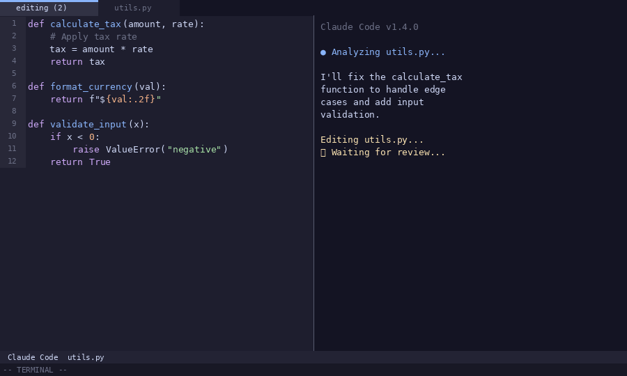
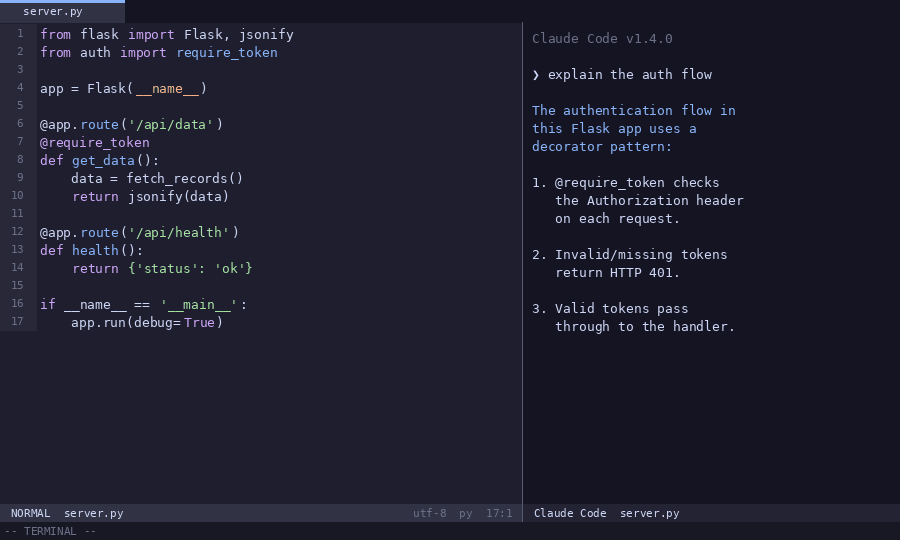

# vim-claude-code

[](https://github.com/rishi-opensource/vim-claude-code/actions/workflows/ci.yml)
[](CHANGELOG.md)

**AI-powered coding, inside Vim. No context switching.**

`vim-claude-code` brings [Claude Code](https://docs.anthropic.com/en/docs/claude-code) directly into your editor. Fix bugs, write tests, review diffs, generate commits, and refactor code — all without leaving Vim.

One keypress opens Claude in a split panel. Another hides it. Your session persists across toggles. Claude edits your files; your buffers reload automatically. You stay in flow.

## Why vim-claude-code?

Most AI coding tools pull you out of your editor — into a browser, a chat window, or a separate terminal. `vim-claude-code` keeps everything inside Vim:

- **No copy-pasting** — commands automatically capture your visual selection or current function
- **No tab switching** — Claude runs in a managed split, toggled with a single key
- **No blind edits** — every file change Claude proposes shows up as a reviewable diff before anything is written to disk
- **No workflow interruption** — buffers reload automatically when Claude modifies files

## Demos


> Toggle, fix bugs, generate tests, explain code, run git workflows, and refactor — all from within Vim.
> See [DEMO.md](doc/DEMO.md) for individual feature walkthroughs.

## Features at a Glance

### Stay in Flow
- **One-key toggle** — `<C-\>` opens and hides Claude. Session persists across toggles.
- **Terminal Zoom** — Maximize Claude to full-screen with `<C-w>z`, tmux-style. Restore your split instantly.
- **Auto file refresh** — Buffers reload when Claude edits your files. No manual `:e` needed.
- **Multiple layouts** — Right split (default), bottom, top, left, floating popup, or dedicated tab.

### Context-Aware Commands
- **Selection-aware** — Commands use your visual selection when active, otherwise detect the current function automatically.
- **22 sub-commands** — Explain, fix, refactor, test, document, commit, review, rename, optimize, debug, and more. All tab-completable.
- **Git-aware** — Claude starts at your repo root. Separate sessions per repository.

### Review Before Claude Writes
- **Diff preview** — Every file edit Claude proposes opens a side-by-side diff tab. Review what changes, then accept or reject. You stay in control.

### Full Git Workflow
- **Commit messages** — Generated from your staged diff, with conventional commit support.
- **Code review** — Claude reviews your current diff with configurable strictness and security checks.
- **PR descriptions** — Generated from your branch changes without leaving the editor.

## Requirements

- Vim 8+ compiled with `+terminal`
- [Claude Code CLI](https://docs.anthropic.com/en/docs/claude-code) installed and in `$PATH`
- Optional: `+popupwin` for floating window mode
- Optional: `python3` for diff preview (`:Claude preview`)

## Installation

> **Stable release — v1.4.0**
> Pin to the latest stable release using the examples below, or omit the tag to always track `main`.

### [vim-plug](https://github.com/junegunn/vim-plug)
```vim
" Always track latest
Plug 'rishi-opensource/vim-claude-code'

" Pin to stable release
Plug 'rishi-opensource/vim-claude-code', { 'tag': 'v1.4.0' }
```

### [Vundle](https://github.com/VundleVim/Vundle.vim)
```vim
Plugin 'rishi-opensource/vim-claude-code'
```
> Vundle does not support tag pinning. To pin manually after install:
> ```sh
> cd ~/.vim/bundle/vim-claude-code && git checkout v1.4.0
> ```

### [pathogen](https://github.com/tpope/vim-pathogen)
```sh
git clone --branch v1.4.0 https://github.com/rishi-opensource/vim-claude-code.git ~/.vim/bundle/vim-claude-code
```

### Native packages (Vim 8+)
```sh
mkdir -p ~/.vim/pack/plugins/start
git clone --branch v1.4.0 https://github.com/rishi-opensource/vim-claude-code.git ~/.vim/pack/plugins/start/vim-claude-code
```

## Quick Start

**1. Open Claude:**
```vim
:Claude
" or press <C-\>
```

**2. Run a health check:**
```vim
:Claude doctor
```
This reports `[OK]` / `[FAIL]` for every dependency and tells you exactly what to fix.

**3. Explore commands with tab completion:**
```vim
:Claude <Tab>
```

The Claude session persists — toggling with `<C-\>` hides and restores the same session.

## Commands

### Terminal

*Open, hide, and manage the Claude terminal session.*

| Command | Description |
|---|---|
| `:Claude` | Toggle the Claude Code terminal |
| `:Claude continue` | Toggle with `--continue` (resume last conversation) |
| `:Claude resume` | Toggle with `--resume` (interactive conversation picker) |
| `:Claude verbose` | Toggle with `--verbose` (detailed logging) |

### Code Intelligence

*Commands work on your visual selection when active, or auto-detect the current function.*

| Command | Flags | Description |
|---|---|---|
| `:Claude explain` | `--brief`, `--detailed` | Explain selected code or current function |
| `:Claude fix` | `--apply`, `--safe` | Fix bugs and correctness issues |
| `:Claude refactor` | `--extract`, `--simplify`, `--optimize`, `--rename` | Refactor code |
| `:Claude test` | `--framework {name}`, `--edge-cases` | Generate unit tests |
| `:Claude doc` | `--inline`, `--markdown` | Generate documentation |

### Git Workflow

*From staged diff to commit message to PR description — without opening a browser.*

| Command | Flags | Description |
|---|---|---|
| `:Claude commit` | `--conventional`, `--amend` | Generate commit message from staged diff |
| `:Claude review` | `--strict`, `--security` | Code review on current diff |
| `:Claude pr` | | Generate PR description |

### Architecture & Planning

*Think through larger problems with Claude before writing code.*

| Command | Description |
|---|---|
| `:Claude plan` | Generate an implementation plan for the current file |
| `:Claude analyze` | Analyze for complexity, performance, and security issues |

### Workflow Utilities

| Command | Description |
|---|---|
| `:Claude rename` | Suggest better variable/function names |
| `:Claude optimize` | Optimize code for performance |
| `:Claude debug` | Analyze the error on the current line |
| `:Claude apply` | Apply Claude's last suggestion to the file (prompts for confirmation) |
| `:Claude zoom` | Toggle full-screen (zoom) mode for the Claude terminal |

### Meta

| Command | Description |
|---|---|
| `:Claude chat` | Send a free-form message with current file context |
| `:Claude context` | Preview what context will be sent to Claude |
| `:Claude model [name]` | Switch model (`sonnet`, `opus`, `haiku`) |

### Utility

| Command | Description |
|---|---|
| `:Claude version` | Show plugin version, Vim version, Claude CLI version, and terminal support |
| `:Claude doctor` | Health check: verifies Claude CLI, Git, terminal support, and Vim version |

## Reviewing Claude's Edits — Diff Preview



When Claude proposes changes to a file, a **side-by-side diff tab opens automatically** before anything is written to disk:

```
  [current file]    │    [proposed changes]
```

Review exactly what Claude wants to change, then use these keys in the diff tab:

| Key | Action |
|---|---|
| `ga` | Accept — send `y` to Claude, apply the change |
| `gr` | Reject — send `n` to Claude, discard the change |
| `q` | Close the diff tab without responding |

**Enable diff preview for your project:**
```vim
:Claude preview install
```

This registers Claude Code hooks in `.claude/settings.local.json`. To auto-enable on every Vim startup:
```vim
let g:claude_code_diff_preview = 1
```

**Diff preview commands:**

| Command | Description |
|---|---|
| `:Claude preview install` | Register diff preview hooks in `.claude/settings.local.json` |
| `:Claude preview uninstall` | Remove diff preview hooks |
| `:Claude preview close` | Manually close an open diff tab |
| `:Claude preview status` | Show diff preview status and dependency checks |

Requires `python3`. Uses Vim `+clientserver` for instant diffs when available, falls back to polling.

## Full-Screen Focus — Terminal Zoom



Working through a complex problem? Press `<C-w>z` inside the Claude terminal to **maximize it full-screen** — just like tmux's zoom. Press again to restore your split layout.

This is especially useful when Claude is generating a long response and you want to read it without distractions.

```vim
" Customize the zoom key
let g:claude_code_map_zoom = '<C-w>z'
```

## Keymaps

### Default keymaps

| Mode | Key | Action |
|---|---|---|
| Normal | `<C-\>` | Toggle Claude Code terminal |
| Normal | `<Leader>cC` | Toggle with `--continue` |
| Normal | `<Leader>cV` | Toggle with `--verbose` |
| Terminal | `<C-\>` | Hide Claude Code terminal |
| Terminal | `<C-w>z` | **Zoom Toggle**: Maximize or restore terminal |
| Terminal | `<C-h/j/k/l>` | Navigate to adjacent window |

### Extended keymaps (`g:claude_code_map_extended_prefix` + key)

| Key | Command | Key | Command |
|---|---|---|---|
| `<Leader>ce` | explain | `<Leader>cG` | commit |
| `<Leader>cf` | fix | `<Leader>cR` | review |
| `<Leader>cr` | refactor | `<Leader>cp` | pr |
| `<Leader>ct` | test | `<Leader>cP` | plan |
| `<Leader>cd` | doc | `<Leader>ca` | analyze |
| `<Leader>cn` | rename | `<Leader>cD` | debug |
| `<Leader>co` | optimize | `<Leader>cA` | apply |
| `<Leader>cc` | chat | `<Leader>cx` | context |
| `<Leader>cm` | model | | |

Visual mode: `<Leader>c` + `e/f/r/t/d/n/o` operate on the selection.

To disable all default keymaps:
```vim
let g:claude_code_map_keys = 0
let g:claude_code_map_extended_keys = 0
```

## Window Layouts

Set `g:claude_code_position` to match your preferred workflow:

| Value | Layout |
|---|---|
| `'right'` | Vertical split on the right (default) |
| `'bottom'` | Horizontal split at the bottom |
| `'top'` | Horizontal split at the top |
| `'left'` | Vertical split on the left |
| `'float'` | Floating popup (requires `+popupwin`) |
| `'tab'` | Dedicated tab page |

```vim
" Bottom split at 30%
let g:claude_code_position   = 'bottom'
let g:claude_code_split_ratio = 0.3

" Floating popup
let g:claude_code_position    = 'float'
let g:claude_code_float_width  = 0.85
let g:claude_code_float_height = 0.85
let g:claude_code_float_border = 'double'
```

## Configuration

| Variable | Default | Description |
|---|---|---|
| `g:claude_code_command` | `'claude'` | CLI executable |
| `g:claude_code_position` | `'right'` | Window layout |
| `g:claude_code_split_ratio` | `0.4` | Terminal size (0.0–1.0) |
| `g:claude_code_enter_insert` | `1` | Auto-enter Terminal mode on focus |
| `g:claude_code_hide_numbers` | `1` | Hide line numbers in terminal |
| `g:claude_code_hide_signcolumn` | `1` | Hide sign column in terminal |
| `g:claude_code_use_git_root` | `1` | Start Claude at git root |
| `g:claude_code_multi_instance` | `1` | Separate session per git repo |
| `g:claude_code_map_keys` | `1` | Register default toggle keymaps |
| `g:claude_code_map_extended_keys` | `1` | Register `<Leader>c*` keymaps |
| `g:claude_code_map_toggle` | `'<C-\>'` | Toggle key |
| `g:claude_code_map_zoom` | `'<C-w>z'` | Zoom key |
| `g:claude_code_map_continue` | `'<Leader>cC'` | Continue key |
| `g:claude_code_map_verbose` | `'<Leader>cV'` | Verbose key |
| `g:claude_code_map_extended_prefix` | `'<Leader>c'` | Prefix for all extended keymaps |
| `g:claude_code_refresh_enable` | `1` | Auto-reload changed buffers |
| `g:claude_code_refresh_interval` | `1000` | Polling interval (ms) |
| `g:claude_code_refresh_notify` | `1` | Notify on buffer reload |
| `g:claude_code_float_width` | `0.8` | Popup width fraction |
| `g:claude_code_float_height` | `0.8` | Popup height fraction |
| `g:claude_code_float_border` | `'rounded'` | Border style |
| `g:claude_code_model` | `''` | Claude model override |
| `g:claude_code_debug` | `0` | Enable debug logging to message area |
| `g:claude_code_diff_preview` | `0` | Auto-start diff preview polling on Vim startup |
| `g:claude_code_terminal_start_delay` | `300` | Delay (ms) before attaching to Claude terminal |

Buffer-local `b:claude_code_*` overrides take precedence over `g:` variables.

## Troubleshooting

**Run the health check first:**
```vim
:Claude doctor
```
This reports `[OK]` / `[FAIL]` for each dependency and tells you exactly what to fix.

---

**E117: Unknown function** — Run `:helptags ALL` then restart Vim. Ensure the plugin directory is on your `runtimepath`.

**Terminal does not open** — Verify `vim --version | grep +terminal`. The plugin requires Vim compiled with `+terminal`.

**Claude not found** — Ensure `claude` is in `$PATH`: `which claude`.

**File changes not detected** — Check `g:claude_code_refresh_enable` is `1` and that `autoread` is not globally disabled in your vimrc.

**Debug logging** — Enable verbose output to diagnose issues:
```vim
let g:claude_code_debug = 1
```
All internal events (dispatch, terminal launch, git calls, refresh) will be printed to the message area.

## Help

```vim
:help claude-code
```

## 🚧 Roadmap

### v1.x
- UX improvements and workflow refinements
- Additional intelligent `:Claude` subcommands
- Improved diagnostics and configuration options

### v2.0
- Official Neovim support
- Improved terminal/window handling
- Floating window UI (Neovim)

Neovim support is planned for v2.0. Contributions are welcome — open an issue or PR on [GitHub](https://github.com/rishi-opensource/vim-claude-code).

## Releases

This project uses [semantic-release](https://github.com/semantic-release/semantic-release) for automated versioning and changelog generation. See [doc/RELEASING.md](doc/RELEASING.md) for details.

## License

MIT — see [LICENSE](LICENSE).

## Changelog

See [CHANGELOG.md](CHANGELOG.md) for full details.
